# AIAA Public Policy Outreach Event 2026

**Connecting Aerospace, Policy, Education, and Community**

**May 1, 2026 | Embry-Riddle Aeronautical University | Daytona Beach, Florida**

Organized by **Public Policy Committee**, AIAA Cape Canaveral Section

---

## Event Summary

| Item                        | Details                                                                                                                       |
| --------------------------- | ----------------------------------------------------------------------------------------------------------------------------- |
| **Event**                   | AIAA Public Policy Outreach Event 2026                                                                                        |
| **Date**                    | May 1, 2026: National Space Day                                                                                               |
| **Location**                | Embry-Riddle Aeronautical University, Daytona Beach, Florida                                                                  |
| **Organizer**               | Public Policy Committee, AIAA Cape Canaveral Section                                                                          |
| **Attendance**              | Approximately 80 attendees                                                                                                    |
| **Student Research**        | 40 student posters                                                                                                            |
| **Primary Focus**           | Aerospace public policy awareness, student engagement, workforce development, professional outreach, and community connection |
| **Sponsors and Supporters** | ERAU College of Engineering, AIAA Cape Canaveral Section, SmallSat Education Inc., One Church Port Orange                     |

**Event Materials**

* [Event Agenda](materials/Agenda.pdf)
* [Student Poster PDFs](posters/)

---

## Background and Purpose

In June 2025, the AIAA Cape Canaveral Section established its first dedicated **Public Policy Officer** role. The purpose of the role was to strengthen awareness of aerospace public policy within the local section and to connect technical, educational, governmental, industrial, and community perspectives.

AIAA’s national advocacy priorities include topics such as aviation emissions and sustainability, space traffic management and space situational awareness, STEM education, and workforce sustainment. These issues are closely connected to aerospace research, engineering, education, workforce development, and public service.

> **Purpose:** Create a local platform for aerospace public policy awareness by connecting students, faculty, professionals, industry leaders, government representatives, and community partners.

The initiative began as a new officer role and developed into a broader committee-based effort focused on outreach, needs assessment, and event development.

---

## Public Policy Committee

Because aerospace public policy intersects with multiple communities, the role was expanded from an individual officer position into a small committee. This structure helped support outreach, coordination, and student engagement.

**Committee members:**

* **Amir Yahyaeian**, Chair
* **Joshua Robinett**, Secretary
* **Alexander Killian**, Student Coordinator

The committee was developed with support and guidance from **Kevin Johnson**, Chair of the AIAA Cape Canaveral Section.

---

## Outreach and Needs Assessment

The first phase of the initiative focused on understanding how aerospace public policy was perceived across the local academic and community environment.

Beginning in summer 2025, the committee reached out to students and faculty at Embry-Riddle Aeronautical University, especially within the Aerospace Engineering and Mechanical Engineering communities. The goal was to understand:

* How familiar students and faculty were with aerospace public policy
* Whether ongoing research had policy relevance
* Whether students and faculty were interested in policy-related engagement
* Where gaps existed between technical work and policy awareness

A key observation emerged:

> Many students and faculty were already working on technical problems with public policy relevance, but the policy dimension of that work was not always visible or explicitly recognized.

Relevant technical areas included:

* Aerospace sustainability
* Space operations and governance
* National and international security
* Aviation systems and regulation
* Workforce development
* Advanced manufacturing and emerging technologies

This finding shaped the direction of the initiative. The objective became not only to discuss public policy, but also to help technical communities recognize how their work connects to broader aerospace challenges.

---

## Campus and Community Connections

The outreach process showed that aerospace public policy requires engagement across several disciplines and communities.

On campus, this included connections between engineering groups and areas related to policy, governance, security, regulation, and international affairs. The committee became more familiar with the following departments:

* Security Studies and International Affairs
* Aeronautical Science Department

Through this campus outreach, the committee identified and became more familiar with faculty whose work intersects with aerospace policy, governance, security, and regulation. This included **Dr. Elisabeth (Hope) Murray**, **Dr. Alice Dell’Era**, and **Dr. Trevor Simoneau**, whose interests connect to areas such as environmental security, national and international security, space policy, and aviation legislation and regulation.

Beyond campus, outreach included engagement with education, community, and government partners.

In October 2025, Amir Yah and Joshua Robinett attended the **SmallSat Education Conference at Kennedy Space Center**, which provided an opportunity to connect with aerospace educators and leaders focused on student opportunity, workforce development, and public engagement.

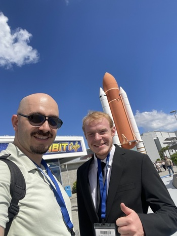

*Figure 1: Amir Yah (left) and Joshua Robinett (right) at Kennedy Space Center during the SmallSat Education Conference, October 2025.*

During this outreach, the committee connected with **Kevin Simmons**, whose experience in aerospace education and workforce development helped inform the event concept.

The committee also engaged with **One Church Port Orange**, including **Pastor Nick Griffin** and **Pastor Jason Burnside**, who support student-centered community-building efforts in the region.

At the government level, **Representative Tyler Sirois** was identified as an important speaker because of the event’s focus on government, governance, and legislative perspectives in space policy.

By the end of 2025, the outreach process had connected four major groups:

* On-campus academic communities
* Off-campus community partners
* Industry and education leaders
* Government representatives

---

## Event Concept and Design

The outreach phase identified a need for a shared platform where these groups could meet, exchange ideas, and understand one another’s perspectives.

> **Identified need:** A local forum connecting aerospace, public policy, education, workforce development, government, and community engagement.

This led to the development of the **AIAA Public Policy Outreach Event 2026**.

Embry-Riddle Aeronautical University was selected as the host location because of its aerospace identity, accessibility, and student-centered environment. During the event-design phase, the committee connected with the **ERAU College of Engineering**, including **Prof. Sherif Ishak** and **Demi Bentley**, to evaluate campus hosting options, align the event with the college environment, and coordinate the logistical requirements for a full-day program.

The event was designed around four communities identified through outreach:

* Academia
* Industry and education
* Government
* Community partners

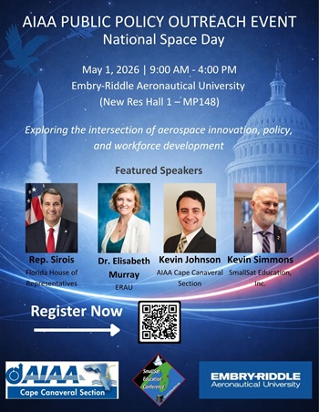

*Figure 2: Official event poster outlining the structure, speakers, and thematic focus of the AIAA Public Policy Outreach Event 2026.*

The speaker program was structured to represent different parts of the aerospace public policy ecosystem:

* **Representative Tyler Sirois** — Government and legislative perspective
* **Dr. Elisabeth (Hope) Murray** — Space policy, governance, and strategic decision-making
* **Kevin Simmons** — Industry, education, and workforce development
* **Kevin Johnson** — AIAA leadership, professional engagement, and community impact

The program was designed so that each session built on the previous one:

1. **Government, Policy & Governance in Space**
2. **Industry, Education & Workforce Development**
3. **Professional Engagement & Community Impact**
4. **Research & Innovation Poster Symposium**

This structure connected policy and governance with education, workforce development, professional service, and student research.

---

## Student-Centered Components

A central goal of the event was to ensure that students were not only attendees, but active participants.

> **Student-centered objective:** Provide students with visibility, a platform to present their work, and direct access to professionals, faculty, government representatives, and community leaders.

To support this objective, the event included a dedicated **Research & Innovation Poster Symposium**. With support from **Ryan Reynolds** and the **Office of Undergraduate Research at ERAU**, students were invited to present their latest research and engage with attendees.

The event included **40 student posters**, reflecting a broad range of research across aerospace engineering, policy-related topics, and adjacent fields.

The poster symposium served two purposes:

* It gave students professional visibility and direct engagement with the aerospace community.
* It helped connect technical research to broader themes such as public policy, sustainability, security, governance, workforce development, and community impact.

In addition, **Margaret O’Brien** was invited to serve as the student speaker because her research was closely connected to space policy. Her presentation helped represent the student voice within the public policy discussion.

---

## Program Overview

The event was held from **9:00 AM to 4:00 PM** on **May 1, 2026**, National Space Day.

The program included:

* Networking breakfast
* Opening remarks and welcome
* Government, policy, and governance session
* Industry, education, and workforce development session
* Student research presentation
* Lunch and networking
* Professional engagement and community impact session
* Closing keynote
* Research & Innovation Poster Symposium

[View Event Agenda](materials/Agenda.pdf)

---

## Event Day Summary

The event began with a **networking breakfast**, giving students, faculty, speakers, professionals, and community members an opportunity to connect before the formal sessions.

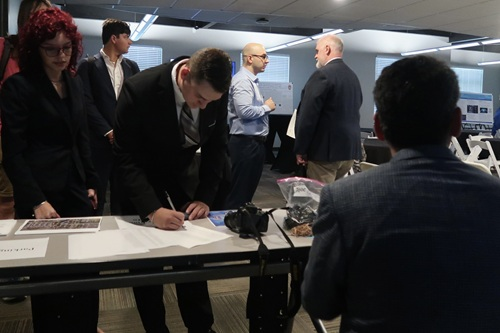

*Figure 3: Attendees check in. Photo credit: Sylvia Scovera.*

*Figure 4: Networking breakfast at the start of the event, providing attendees an opportunity to connect before the formal sessions. Photo credit: Sylvia Scovera.*

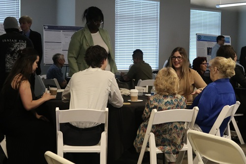

*Figure 5: Networking breakfast at the start of the event. Photo credit: Sylvia Scovera.*

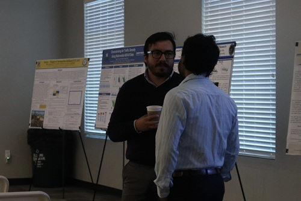

*Figure 6: Networking breakfast at the start of the event. Photo credit: Sylvia Scovera.*

The program officially opened with welcoming remarks, an introduction to AIAA, the objectives of the event, and an overview of the day.

### Session 1: Government, Policy, and Governance in Space

The first session focused on how government, policy, and governance shape the aerospace sector.

* **Representative Tyler Sirois** provided a government perspective on current space policy priorities, legislative direction, and the role of government in advancing the space sector.

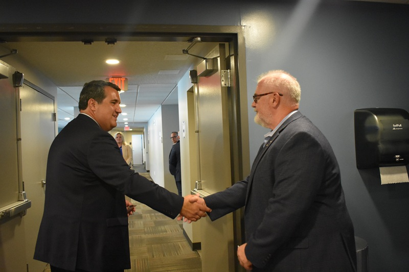

*Figure 7: Representative Tyler Sirois (left) and Kevin Simmons (right). Photo credit: Mehdi Ghanati.*

  
* **Dr. Elisabeth Murray** discussed policy frameworks, global governance, and strategic decision-making in the evolving space ecosystem.

Together, these talks established the policy and governance foundation for the event.

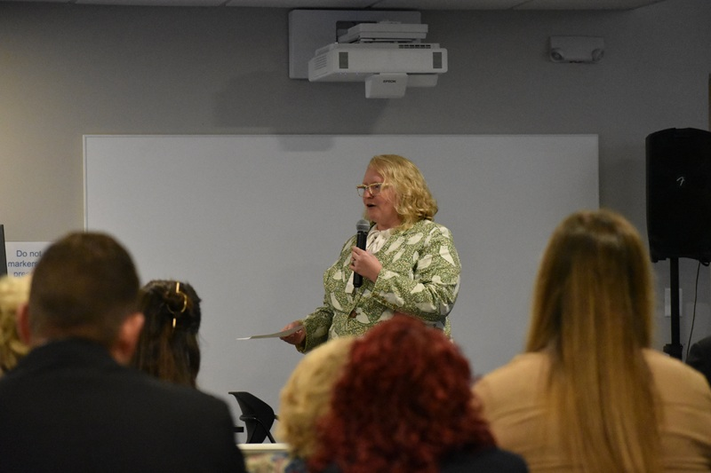

*Figure 8: Dr. Elisabeth Murray. Photo credit: Mehdi Ghanati.*

### Session 2: Industry, Education, and Workforce Development

The second session focused on workforce development and the relationship between education and industry.

* **Kevin Simmons** discussed industry needs, workforce development, and collaboration between private sector organizations and educational institutions.

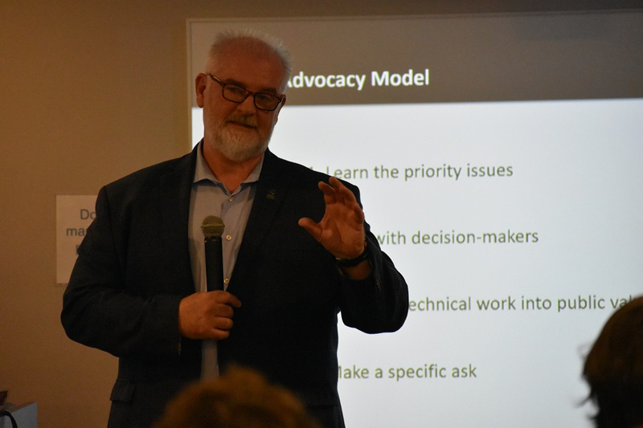

*Figure 9: Kevin Simmons. Photo credit: Mehdi Ghanati.*

  
* A **student research presentation** reinforced the role of students as active contributors to the aerospace ecosystem.
  

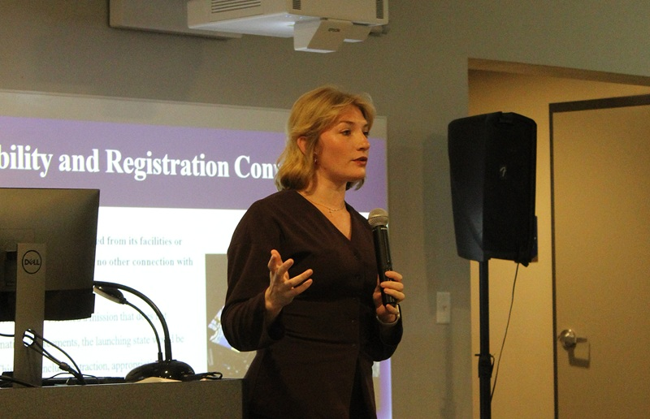

*Figure 10: Margaret O’Brien delivering the student research presentation, highlighting the role of student work in aerospace policy and public engagement. Photo credit: Hannah Hodge.*

This session connected aerospace policy to the practical challenge of preparing the next generation of professionals.

### Lunch and Networking

Lunch provided time for attendees to speak directly with speakers, sponsors, students, and peers. This informal networking supported one of the event’s core goals: building connections across communities.

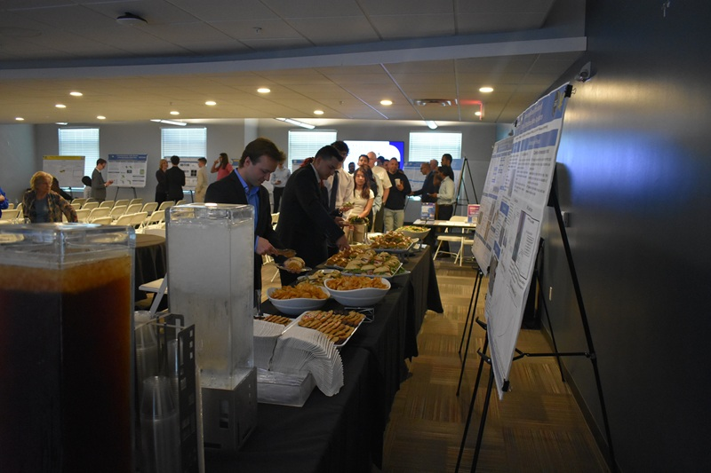

*Figure 11: Lunch and networking session. Photo credit: Mehdi Ghanati.*

The closing remarks helped frame the event as a connected discussion rather than a set of independent talks.

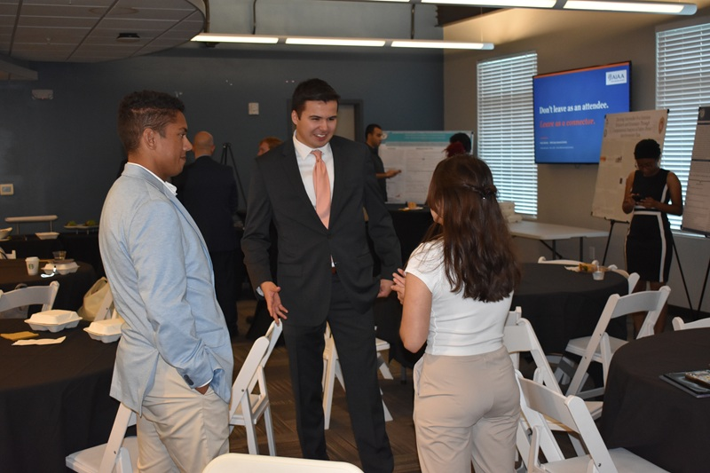

*Figure 12: Lunch and networking session. Photo credit: Mehdi Ghanati.*

The closing remarks helped frame the event as a connected discussion rather than a set of independent talks.

### Session 3: Professional Engagement and Community Impact

The third session focused on professional engagement and the role of AIAA in supporting the aerospace community.

* **Kevin Johnson** discussed AIAA and community impact, emphasizing the role of professional organizations in policy engagement, public outreach, and support for students and early-career professionals.

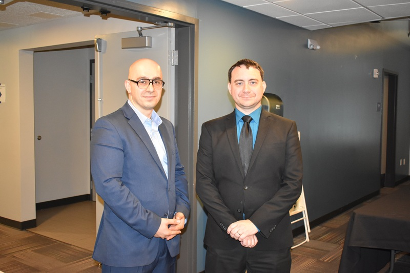

*Figure 13: Amir Yah (left) and Kevin Johnson (right). Photo credit: Mehdi Ghanati.*

* **Joshua Robinett** delivered the closing keynote, summarizing the major themes of the day: policy, innovation, collaboration, education, workforce development, and student engagement.

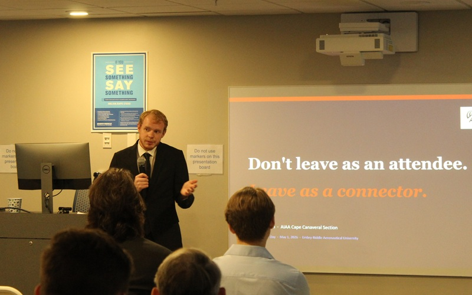

*Figure 14: Joshua Robinett. Photo credit: Hannah Hodge.*

The closing remarks helped frame the event as a connected discussion rather than a set of independent talks.

---

## Research and Innovation Poster Symposium

Following the formal sessions and a networking break, the event transitioned into the **Research & Innovation Poster Symposium**.

Students and researchers presented work across aerospace engineering, policy, and related fields. Attendees moved through the poster area, asked questions, provided feedback, and learned about current student research.

The symposium was one of the most important components of the event because it placed students at the center of the program and created a direct connection between student research and the broader aerospace community.

[View Student Poster PDFs](posters/)

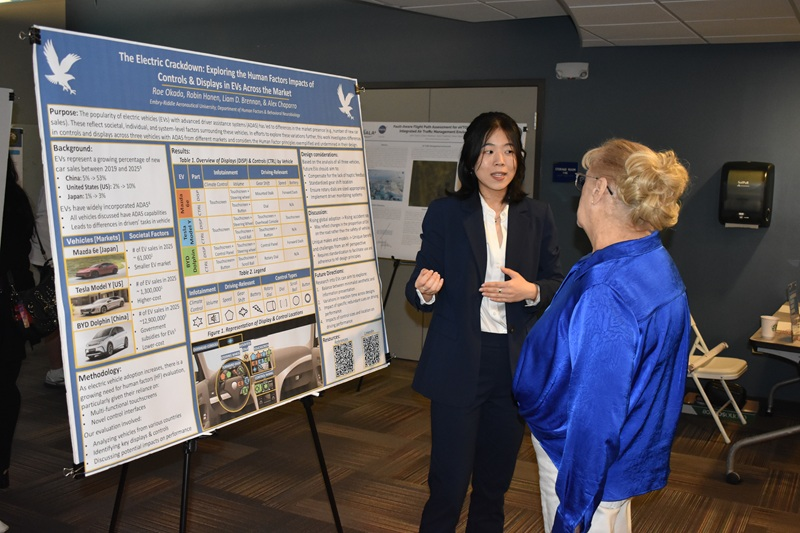

*Figure 15: Research & Innovation Poster Symposium. Photo credit: Mehdi Ghanati.*

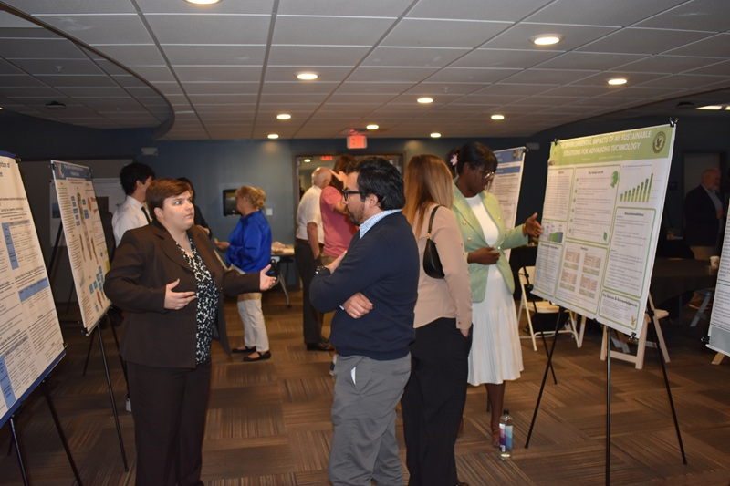

*Figure 16: Research & Innovation Poster Symposium. Photo credit: Mehdi Ghanati.*

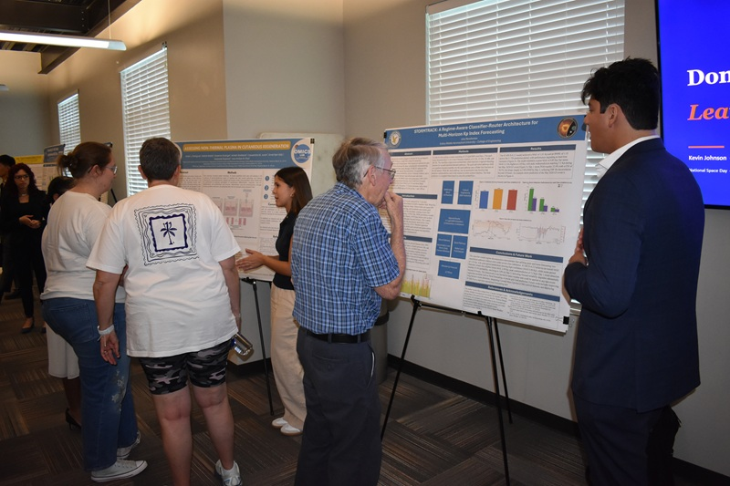

*Figure 17: Research & Innovation Poster Symposium. Photo credit: Mehdi Ghanati.*

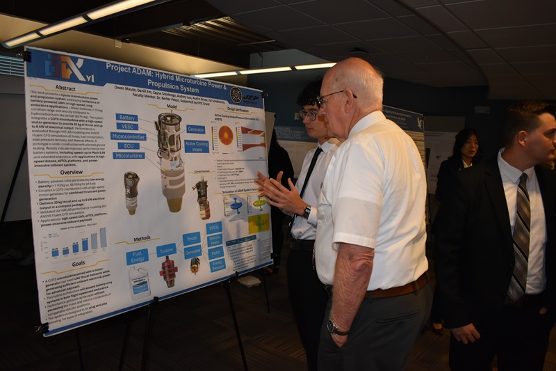

*Figure 18: Research & Innovation Poster Symposium. Photo credit: Mehdi Ghanati.*

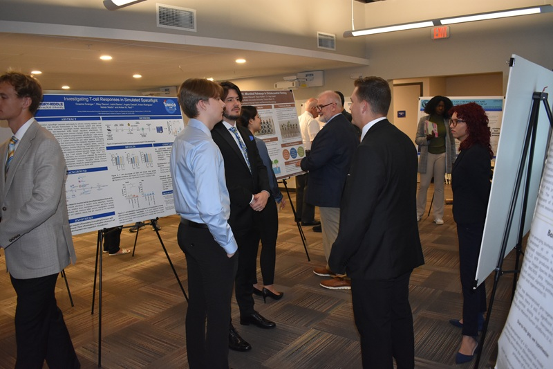

*Figure 19: Research & Innovation Poster Symposium. Photo credit: Mehdi Ghanati.*

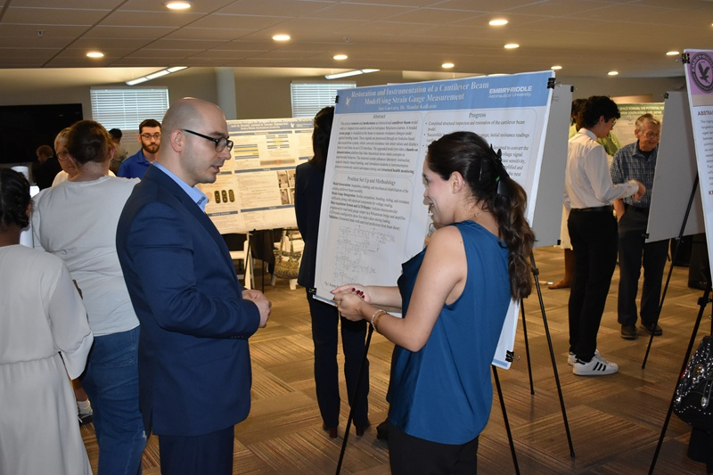

*Figure 20: Joshua Robinett. Photo credit: Mehdi Ghanati.*

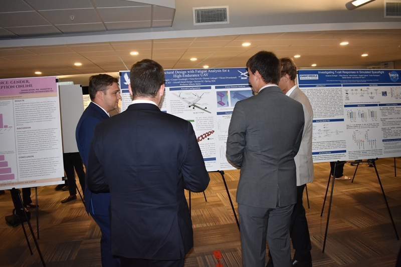

*Figure 21: Research & Innovation Poster Symposium. Photo credit: Mehdi Ghanati.*

---

## Outcomes

The AIAA Public Policy Outreach Event 2026 achieved several outcomes:

* Brought together approximately **80 attendees** from academia, industry, government, student organizations, and the broader community
* Featured  **40 student posters** through the Research & Innovation Poster Symposium
* Created a local platform for aerospace public policy discussion
* Connected students with faculty, professionals, industry and education leaders, government representatives, and community partners
* Increased awareness of how technical aerospace research can relate to public policy priorities
* Strengthened the role of the AIAA Cape Canaveral Section as a bridge between students, professionals, policy discussions, and community outreach
* Demonstrated a practical, student-centered model for aerospace public policy engagement

> Public policy does not have to remain abstract or distant. It can be brought into direct conversation with research, education, professional development, and local community engagement.

---

## Sponsors and Acknowledgments

This event was made possible through the support and dedication of many individuals and organizations.

**Sponsors and supporters:**

* **Embry-Riddle Aeronautical University College of Engineering**
* **AIAA Cape Canaveral Section**
* **SmallSat Education Inc.**
* **One Church Port Orange**

Special thanks to **Kevin Johnson** for his leadership, encouragement, and guidance throughout the development of the Public Policy Committee and this event.

Thank you to **Representative Tyler Sirois**, **Dr. Elisabeth (Hope) Murray**, and **Kevin Simmons** for kindly accepting our invitation, serving as speakers, and sharing their perspectives with the community.

Thank you to **Prof Ishak** and **Demi Bentili** and the college of engineering at ERAU for their support, coordination, and assistance in making the event possible.

Thank you to **Ryan Reynolds** and the Office of Undergraduate Research at ERAU for supporting the student poster symposium.

Thank you to **Margaret O’Brien** and her advisor **Dr. Trevor Simoneau** for contributing as the student speaker and representing the student voice in the public policy conversation.

Thank you to **Pastor Nick Griffin**, **Pastor Jason Burnside**, **Pastor Stephen Storms** and the One Church Port Orange community for supporting student outreach and helping connect this initiative with the broader community.

Finally, thank you to all students, faculty, speakers, volunteers, sponsors, and attendees who contributed to the success of the event.

---

## Looking Forward

The AIAA Public Policy Outreach Event 2026 was the result of nearly a year of outreach, relationship-building, and committee work.

The initiative began with a new public policy role and developed into a committee, a network of partnerships, and a full-day event centered on students, policy, education, workforce development, government, and community engagement.

Moving forward, the goal is to continue building platforms that help students recognize the broader impact of their work, help professionals engage with policy conversations, and help communities understand how aerospace innovation connects to public service and the future of society.

---

**Amir Yah**

May 2026
